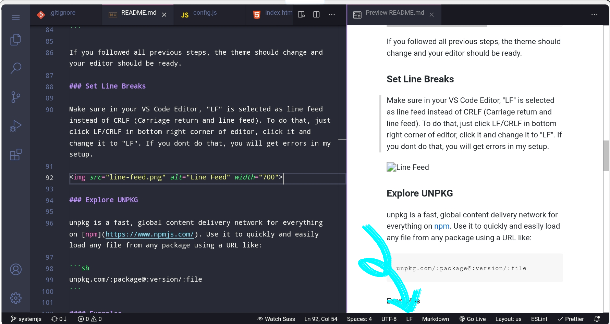

# React 17 Startup Code

- [SystemJS]()
- [NodeJS]()
- [Webpack]()
<!-- TABLE OF CONTENTS -->

## Table of Contents

- [How to run](#how-to-run)
- [Editor Setup](#editor-setup)
  - [Plugins](#plugins)
  - [Settings](#settings)
  - [Set Line Breaks](#set-line-breaks)
- [Explore UNPKG](#explore-unpkg)
  - [Examples](#examples)
  - [Environment](#environment)
- [Create Brand new Local Git Repo](#create-a-brand-new-local-repository)
- [Contact](#contact)

<!-- HOW TO RUN -->

## How to run

Please follow the below instructions to run this project in your computer:

1. Clone this repository
   ```sh
   git clone https://github.com/sarbanandabhikkhu/React-17.git
   ```
2. Checkout to branch "systemjs"
   ```sh
   git checkout systemjs
   ```
3. Run your app using VSCode Live Server
4. Your app should be available in http://localhost:5500

Downloads dependency files from [UNPKG](https://unpkg.com/)

<!-- Editor Setup -->

## Editor Setup

You can use any editor but as I personally prefer VS Code. I will give some instructions about how I prefer VS code to be setup for React applications with SystemJS.

### Plugins

You need to install the below plugins:

- [ESLint](dbaeumer.vscode-eslint) by Dirk Baeumer
- [Prettier - Code formatter](esbenp.prettier-vscode") by Prettier
- [Dracula Officia Theme](dracula-theme.theme-dracula) (optional)
- [Live Server](ritwickdey.liveserver) by Ritwick Dey
- [Auto Complete Path](ionutvmi.path-autocomplete)
- [Auto Rename Tag](formulahendry.auto-rename-tag)

### Settings

Follow the below settings for VS Code -

1. Create a new folder called ".vscode" inside the project root folder
2. Create a new file called "settings.json" inside that folder.
3. Paste the below json in the newly created settings.json file and save the file.

```json
{
  "editor.minimap.enabled": false,
  "breadcrumbs.enabled": false,
  "workbench.colorTheme": "Dracula",
  "editor.defaultFormatter": "esbenp.prettier-vscode",
  "editor.formatOnSave": true,
  "editor.codeActionsOnSave": {
    "source.fixAll.eslint": true,
    "source.fixAll.tslint": true
    // "source.organizeImports": true
  },
  "javascript.validate.enable": true, //disable all built-in syntax checking
  "eslint.alwaysShowStatus": true,
  "emmet.triggerExpansionOnTab": true,
  "emmet.includeLanguages": {
    "javascript": "javascriptreact"
  }
}
```

If you followed all previous steps, the theme should change and your editor should be ready.

### Set Line Breaks

Make sure in your VS Code Editor, "LF" is selected as line feed instead of CRLF (Carriage return and line feed). To do that, just click LF/CRLF in bottom right corner of editor, click it and change it to "LF". If you dont do that, you will get errors in my setup.



### Explore UNPKG

unpkg is a fast, global content delivery network for everything on [npm](https://www.npmjs.com/). Use it to quickly and easily load any file from any package using a URL like:

```sh
unpkg.com/:package@:version/:file
```

#### Examples

**Using a fixed version:**

- [unpkg.com/react@17.0.2/umd/react.production.min.js](https://unpkg.com/react@17.0.2/umd/react.production.min.js)
- [unpkg.com/react-dom@17.0.2/umd/react-dom.production.min.js](https://unpkg.com/react-dom@17.0.2/umd/react-dom.production.min.js)

You may also use a [semver range](https://docs.npmjs.com/misc/semver) or a [tag](https://docs.npmjs.com/cli/dist-tag) instead of a fixed version number, or omit the version/tag entirely to use the `latest` tag.

- [unpkg.com/react@latest/umd/react.production.min.js](https://unpkg.com/react@latest/umd/react.production.min.js)
- [unpkg.com/react@^17/umd/react.production.min.js](https://unpkg.com/react@^17/umd/react.production.min.js)
- [unpkg.com/react/umd/react.production.min.js](https://unpkg.com/react/umd/react.production.min.js)

If you omit the file path (i.e. use a “bare” URL), unpkg will serve the file specified by the `unpkg` field in `package.json`, or fall back to `main`.

- [unpkg.com/jquery](https://unpkg.com/jquery)
- [unpkg.com/three](https://unpkg.com/three)

Append a `/` at the end of a URL to view a listing of all the files in a package.

- [unpkg.com/react/](https://unpkg.com/react/)
- [unpkg.com/react-router/](https://unpkg.com/react-router/)

#### Environment

Some dependencies are provide optimized files for the enviroment purpose.
If you want to using those files in your environment `development` or `production` just replace your file reference name.

**For the Example:**

```sh
// development mode
react@latest/umd/react.development.js

// production mode
react@latest/umd/react.production.min.js
```

### Create a Brand new Local Repository

```sh
cd /sdcard/directory
mkdir my-app
cd my-app

git config --global --add safe.directory /storage/emulated/0/directory/my-app
git config --global user.email "someone@gmail.com"
git config --global user.name "someone"
git config --global init.defaultBranch main

git touch .gitignore
git touch .README.md

git add .
git commit -m "initial commit"
git branch -M mains
git remote add origin https://github.com/somone/my-app.git
git push -u origin main

git branch
git branch development
git checkout development
git add .
git commit -m "development"
git push origin developmentcommit"
```

<!-- CONTACT -->

## Contact

Sumit Saha - [sarbanandabhikkhu@gmail.com](mailto:sarbanandabhikkhu@gmail.com)

Project Link: [https://github.com/sarbanandabhikkhu/React-17](https://github.com/sarbanandabhikkhu/React-17)

Youtube Channel: [https://youtube.com/SarbaNandaBhikkhu](https://youtube.com/SarbaNandaBhikkhu)

[![Facebook-Page][facebook-shield]][facebook-url]
[![Instagram][instagram-shield]][instagram-url]
[![LinkedIn][linkedin-shield]][linkedin-url]
[![Youtube][youtube-shield]][youtube-url]

## Creadit

&copy; SarbaNanda Bhikkhu

<!-- MARKDOWN LINKS & IMAGES -->

[facebook-shield]: https://img.shields.io/badge/-Facebook-black.svg?style=flat-square&logo=facebook&color=555&logoColor=white
[facebook-url]: https://facebook.com/letslearnwithsumit
[instagram-shield]: https://img.shields.io/badge/-Instagram-black.svg?style=flat-square&logo=instagram&color=555&logoColor=white
[instagram-url]: https://instagram.com/learnwithsumit
[linkedin-shield]: https://img.shields.io/badge/-LinkedIn-black.svg?style=flat-square&logo=linkedin&colorB=555
[linkedin-url]: https://linkedin.com/company/learnwithsumit
[youtube-shield]: https://img.shields.io/badge/-Youtube-black.svg?style=flat-square&logo=youtube&color=555&logoColor=white
[youtube-url]: https://youtube.com/sarbanandabhikkhu
